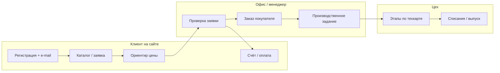

# Laser ERP — стратегия запуска и дорожная карта

Дата: 20.09.2026  
Аудитория: владелец производства (не программист) + команда внедрения  
Связанный документ: [production_master_plan.md](./production_master_plan.md) (внутренний контур цеха, M1–M5 уже **done**)

---

## 1. Зачем этот документ

Ответить на три вопроса:

1. **Что уже можно использовать** без доработок.
2. **Что мешает** принимать заказы от клиентов «в бою».
3. **В каком порядке** дорабатывать, чтобы не ломать работающее и не строить «всё сразу».

**Главный принцип:** сначала **узкий живой контур** (каталог → заявка → расчёт → заказ → производство по **готовой** техкарте), потом автоматизация «индивидуального лазера» и диспетчеризация.

---

## 2. Картина «как должно быть» (целевое состояние)

**Важно про техкарты:** сегодня ERP **не изобретает техкарту из DXF с нуля**. Она **подбирает существующую техкарту изделия** (или шаблон изделия из каталога). Авторасчёт по DXF сейчас даёт **метры реза/гравировки и ориентир цены**, а не полный новый состав материалов.

---

## 3. Что уже сделано (опора)

| Блок | Статус | Что это даёт |
|------|--------|----------------|
| Склад, материалы, приёмка, покрытия, абразивы | Работает | Остатки и цены для себестоимости |
| Техкарты A/B (шлифование, грунт) на формат 900×600×6 | Есть (узкий набор) | Образец «правильной» карты |
| Производство M1–M5 (проведение, этапы, резервы, заказ→задание) | **Done** в master-плане | Цех в админке **может** вести задания корректно |
| Заказ покупателя → производственное задание | **Есть** (`create_from_order_item`) | Нужна **техкарта на изделие** |
| Заявка клиента (`ProductionRequest`) | **Есть** на сайте | Каталог / DXF, черновая цена, чат, счета |
| Конвертация заявки → заказ покупателя | **Есть** (действие в админке) | Вручную, не одной кнопкой «в производство» |
| Каталог, корзина, checkout | **Есть** | Параллельный путь к заказу |
| Workspace (клиент / сотрудник) | **Недавно добавлен** | Кабинет вместо «голой» админки для части ролей |
| Боевой сайт | `https://laser-erp.armada.sx` | Код на GitHub **main**; на VPS нужен **sync + migrate** |

---

## 4. Разрывы (что клиент ожидает, а система ещё не замыкает)

| № | Разрыв | Сейчас | Риск если игнорировать |
|---|--------|--------|-------------------------|
| G1 | **Запуск на VPS** | Новый код и миграции 0131–0132 могут быть не на сервере | 500 при входе/логировании, старый UI |
| G2 | **Доступ админки / SMTP** | Пароль Admin, письма подтверждения e-mail | Клиент не подтвердит почту → нет заявки |
| G3 | **Каталог = реальные SKU** | Не все изделия с фото, ценой, **техкартой** | Заявка/заказ без производства |
| G4 | **Заявка → производство** | 2–3 ручных шага в админке (заявка→заказ→задание) | Ошибки, задержки (задача **S5** в master-плане — **todo**) |
| G5 | **Индивидуальный DXF** | Цена-ориентир по метрам; **нет** авто-техкарты под каждый макет | Обещать «полный автомат» рано |
| G6 | **Цех вне админки** | Рабочее место исполнителя (**S4**) — **todo** | Мастера не будут пользоваться |
| G7 | **Правовой/UX контур** | Оферта, сроки, статусы заявки для клиента | Споры, недоверие |

---

## 5. Стратегия (три горизонта)

### Горизонт A — «Принимаем заказы» (4–6 недель календарно, по согласованным спринтам)

**Цель:** клиент на armada.sx оформляет **каталожную** заявку, видит **ориентир цены**, менеджер доводит до **заказа и производственного задания** по **готовой** техкарте.

**Не делаем пока:** полная автогенерация техкарт из DXF, диспетчерская, бухгалтерская себестоимость (N1–N2).

### Горизонт B — «Меньше ручного труда в офисе» (6–10 недель)

**Цель:** сократить клики менеджера (S5), связать счёт/оплату со статусами, типовые персонализации (надпись/лого) в нормах.

### Горизонт C — «Индивидуальный лазер и цех в UI» (10+ недель)

**Цель:** шаблоны техкарт под семейства макетов, полуавтомат норм из DXF, экран мастера (S4), учёт времени (S3).

---

## 6. Дорожная карта — что делать **первым**

Приоритет = влияние на «клиент уже заказывает» × простота.

### Фаза 0 — Запуск контура (1–2 недели) **СТАРТ ЗДЕСЬ**

| ID | Задача | Критерий «готово» | Ответственный |
|----|--------|-------------------|---------------|
| 0.1 | Обновить VPS: код с **main**, `migrate`, `collectstatic`, restart | Сайт открывается, `/admin` и `/workspace` без 500 | DevOps |
| 0.2 | Восстановить вход **Admin**, проверить SMTP / подтверждение e-mail | Тестовый клиент регистрируется и подтверждает почту | DevOps |
| 0.3 | **Пилотный каталог**: 3–5 изделий «как в продаже» | У каждого: фото, цена/себестоимость, **техкарта**, остатки/заготовка | Производство + ERP |
| 0.4 | Сценарий «день сурка» на **копии** или вечером на бою | 1 полный проход (см. чеклист ниже) за ≤ 30 мин руками менеджера | Владелец |

**Чеклист одного пилотного заказа (каталог):**

1. Клиент: регистрация → письмо → подтверждение e-mail.  
2. Клиент: «Заказ на производство» → изделие из каталога → количество → видит **ориентир цены**.  
3. Сотрудник: workspace / админка → заявка **в обработке** → комментарий / счёт (если нужно).  
4. Админ: **конвертировать в заказ покупателя**.  
5. Админ: из позиции заказа → **создать производственное задание** (техкарта подтягивается).  
6. Цех: провести этап в задании → списания/остатки сходятся.

Если любой шаг падает — **не идём в фазу 1**, чиним фазу 0.

---

### Фаза 1 — Клиентский опыт «можно пользоваться» (2–4 недели)

| ID | Задача | Результат |
|----|--------|-----------|
| 1.1 | Понятные статусы заявки на сайте (новая / в работе / оценена / счёт) | Клиент не звонит «что с заказом» |
| 1.2 | Блокировка заявки без verified e-mail — сообщение **человеческим языком** | Меньше «не работает» |
| 1.3 | Каталог: только изделия **готовые к производству** (флаг «в витрине») | Нет заказа «пустышки» |
| 1.4 | Обучение менеджера: 1 страница «кнопки после заявки» | См. раздел 8 |
| 1.5 | Мониторинг: журнал действий (`UserActionLog`), ошибки Django на VPS | Быстро ловим сбои входа |

---

### Фаза 2 — Склейка заявка → производство (3–5 недель, **S5**)

| ID | Задача | Результат |
|----|--------|-----------|
| 2.1 | Одна операция «Согласовано → заказ + производственное задание» | Вместо 2–3 действий — одна |
| 2.2 | Связь `ProductionRequest` ↔ `Order` ↔ `ProductionAssignment` в UI | Трассировка для менеджера |
| 2.3 | Правила: нет техкарты → заявка не переводится в производство, alert | Не создаём «пустые» задания |
| 2.4 | Автотест на цепочку заявка→заказ→задание | Регрессии не ломают запуск |

*Это прямое продолжение **S5** из [production_master_plan.md](./production_master_plan.md).*

---

### Фаза 3 — Расчёт и индивидуальные макеты (5–8 недель)

| ID | Задача | Результат |
|----|--------|-----------|
| 3.1 | Калибровка ставок реза/гравировки под реальные цены | Ориентир DXF близок к прайсу |
| 3.2 | Семейства изделий «лазер + фанера ФК» с **шаблонной** техкартой | Не новая карта на каждый DXF, а вариант изделия |
| 3.3 | Менеджер: «утвердить нормы» после DXF → копия техкарты | Контролируемый полуавтомат |
| 3.4 | Расширение техкарт A/B на другие форматы ФК (как в каталоге) | Производство не упирается в 900×600 |

---

### Фаза 4 — Цех и планирование (после стабильных заказов)

| ID | Задача | Связь с master-планом |
|----|--------|------------------------|
| 4.1 | Рабочее место исполнителя | **S4** |
| 4.2 | LaborTimeLog по нормам | **S3** |
| 4.3 | Диспетчерская / очередь | **N1** |
| 4.4 | Себестоимость в финансы | **N2** |

---

## 7. Что **не** ставим в «первую очередь»

- Полностью автоматическая техкарта из произвольного DXF без участия технолога.  
- Диспетчерская загрузки и интеграция с бухгалтерией.  
- Копирование всех техкарт на все форматы фанеры «за один спринт».  
- Переписывание legacy-партий (N4).

---

## 8. Шпаргалка менеджера (текущий процесс)

Пока не сделана **фаза 2**, порядок такой:

1. **Заявки на производство** (админка или employee workspace) — проверить макет, скан, ориентир цены.  
2. Действие **«Конвертировать в заказ покупателя»**.  
3. **Заказ покупателя** → позиция → **создать производственное задание** (нужна техкарта на изделие).  
4. **Производственное задание** → резервы / снабжение / проведение этапов.

Клиентский вход: **https://laser-erp.armada.sx** → регистрация → подтверждение e-mail → заказ на производство / каталог.

---

## 9. KPI «ERP в работе»

| Метрика | Цель к концу фазы 1 | Цель к концу фазы 2 |
|---------|---------------------|---------------------|
| Заявки с сайта в неделю | ≥ 1 реальная | ≥ 3 |
| Доля заявок с техкартой в производстве | 100% пилота | 100% каталога |
| Время менеджера «заявка → задание» | ≤ 30 мин | ≤ 5 мин |
| Ошибки 500 на armada | 0 в неделю | 0 |

---

## 10. Как будем вести работу по карте

1. Берём **только следующую фазу** (сейчас **фаза 0**).  
2. Каждую задачу закрываем **критерием «готово»** + короткая запись в журнал (внизу).  
3. После фазы 0 — короткая встреча «идём в фазу 1 или чиним пилот».  
4. Технический master-план производства (M/S/N) **не отменяем** — фазы 2–4 стыкуются с **S5, S4, S3, N1**.

### Журнал решений

| Дата | Событие |
|------|---------|
| 20.09.2026 | Утверждена стратегия запуска; приоритет — фаза 0 (VPS + пилотный каталог + один сквозной заказ). |
| 20.09.2026 | Код workspace/quote/UserActionLog на GitHub **main**; VPS — обновить отдельно. |

---

## 11. Следующий шаг для команды с Cursor

**Фаза 0.1–0.2:** обновление VPS и доступ (когда есть SSH без VPN).  
**Фаза 0.3:** согласовать список 3–5 изделий пилота (имена карточек в каталоге).  

После вашего «да» на список изделий — заводим карточки/техкарты или проверяем существующие.
